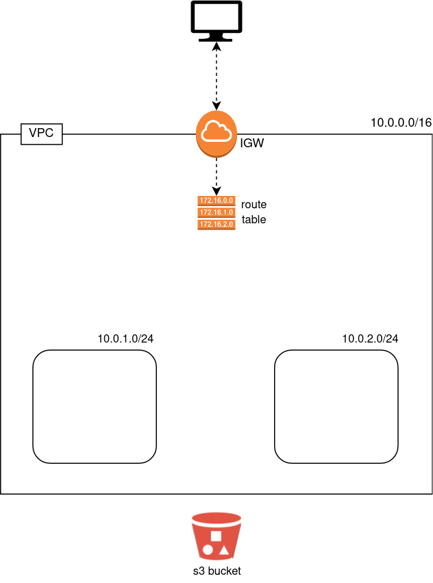

# Exercise 10 - IGW - Route table

|  |  |
| ---: | :--- |
| Turn-in directory: | ex10 |
| Files to turn in: | 00\_variables.tf, 01\_networking.tf, 10\_terraform.auto.tfvars |
| Forbidden function: | None |
| Remarks: | n/a |

Let's continue our infrastructure! We created a Network with VPC and divided our network into subnets into two different availability zones. However, our network is still not accessible from the internet \(or your IP\). First, we need to create an internet gateway and link it with our VPC. This first step will allow us to interact with the internet.

The subnets we created will be used to host our EC2 instances but our subnets are now disconnected from the internet and other IPs within the VPC. To fix this problem, we will create a route table \(it acts like a combination of a switch \(when you interact with IPs inside your VPC\) and a router \(when you want to interact with external IPs\)\).

{width=300px}

## Exercise

Create an Internet gateway \(IGW\) which depends on the VPC you created. Your IGW will need the tags:

* `project_name` with the value `module02`
* `Name` with the value `module02-igw`

Create a route table that depends on the VPC and the IGW. Your route table will have to implement a route linking the `0.0.0.0/0` CIDR Block with the IGW. The `0.0.0.0/0` is really important in the IP search process, it means if you cannot find the IP you are looking for within the VPC then search it on other networks \(through the IGW\). Your route table will need the following tags:

* `project_name` with the value `module02`
* `Name` with the value `module02-rt`

You thought you were finished ? We now need to associate our subnets to the route table ! Create route table associations for both of your subnets. They will depend on the route table and the concerned subnet.

